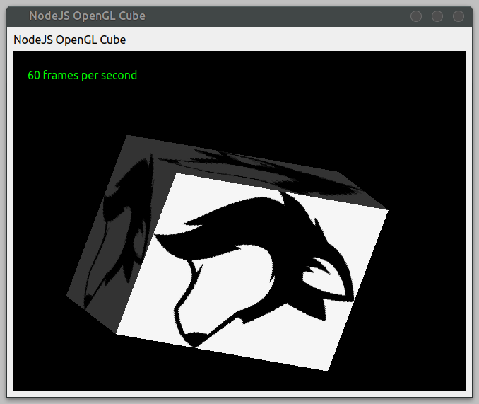
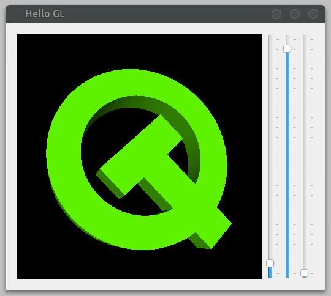

# nodegui-plugin-opengl
OpenGL support plugin for [NodeGui](https://github.com/nodegui/nodegui)

WORK IN PROGRESS

This plugin aims to cover the most important functionality from Qt's (modern) OpenGL related classes. Although it is not complete it is already capable of the core OpenGL features.

# Trying it out

Use git to clone down this repository, run `npm install`, run `npm build`, and then run `npm run demo:cube` or one of the other demos like `demo:hellogl2` or `demo:triangle`.

# Maintainer

Simon Edwards <simon@simonzone.com>

# License

MIT
